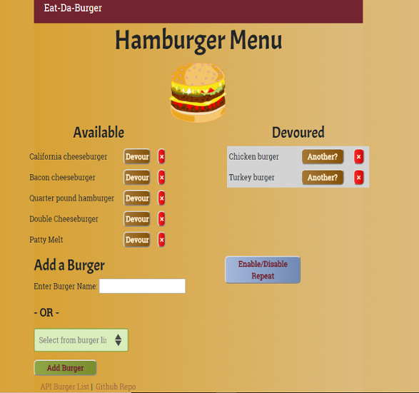
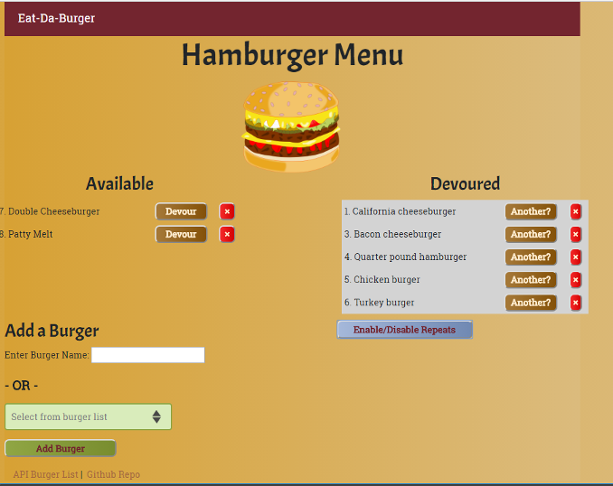

# Eat-Da-Burger
Burger logger.

## Description

Eat-Da-Burger is designed to be a restaurant app. A user can enter a burger name or select one from an options menu. The burger then appears on the left side of the screen, waiting to be devoured. Once it is devoured with a press of a button, it moves to the right side of the screen. This application stores every burger and its devoured state in a database.

## Technical Information

The burger app is essentially a logger that leverages the  Node and Express for the server and API routes, MySQL for database storage, and Handlebars for html template design and a custom ORM (Object Relational Mapping).

The left side of the screen displays the 'available' hamburgers. On the bottom left of the screen, the user has the option of either writing in a custom hamburger choice or selecting one from the burger menu list. When the user has decided what type of burger, he or she can press the 'add burger' button.

On the right side of the screen are the 'devoured' burgers. These have a devoured state of true.
The bottom right of the screen has an 'Enable/Disable Repeats' button, which toggles the 'Another' and 'x' buttons. The 'Another' button allows the user to have seconds. The 'x' button behaves similarly to the 'x' button on the left; it deletes the associated burger from the burger database.

The user also has the option of selecting a burger from the 'select burger' menu. When the user clicks the "Add Burger" button, the burger is added to the burgers database. More burgers can be listed on the select option menu by adding entries to the `./models/burger_options.js` file.

The 'Enable/Disable Repeats' state can be toggled in case the user wants to have a burger of the same type. The 'Another' and 'x' options can be hidden by clicking the 'Enable/Disable Repeats' button again.

## Installation

The burger app can be cloned and installed following the procedure below.

1. Now we are ready to clone this app by running the following command. `git clone git@github.com:f-flores/burger.git` Note that if `git` and `node` need to be installed, the steps to do so are the following: a) git must be installed. [Download git.](https://git-scm.com/downloads) and b. nodejs must also be installed. [Download nodejs](https://nodejs.org/en/download/)

2. Since this file makes use of several node modules, please run `npm install`.  This installs all of the dependencies.

3. `burger` is a full stack app that uses nodejs and express on the back end. It needs to be deployed to on a platform that provides (like Heroku) "back-end" support. [Guide to deploying a Node Web Server on Heroku](https://github.com/RutgersCodingBootcamp/RUTSOM201801FSF4-Class-Repository-FSF/blob/master/13-express/Supplemental/HerokuGuide.md)

4. It is also necessary to setup MySQL for the burger app. Please refer to the following guide. [Guide](https://github.com/RutgersCodingBootcamp/RUTSOM201801FSF4-Class-Repository-FSF/blob/master/14-handlebars/Supplemental/MySQLHerokuDeploymentProcess.pdf)

## Comments

The source code for the burger app was added to the following github repository:
[burger](https://github.com/f-flores/burger)

A link to the burger app on heroku:
[burger app](https://enigmatic-reef-11009.herokuapp.com/)